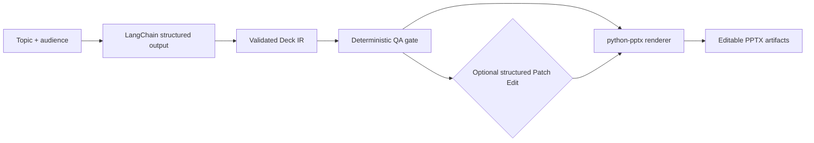
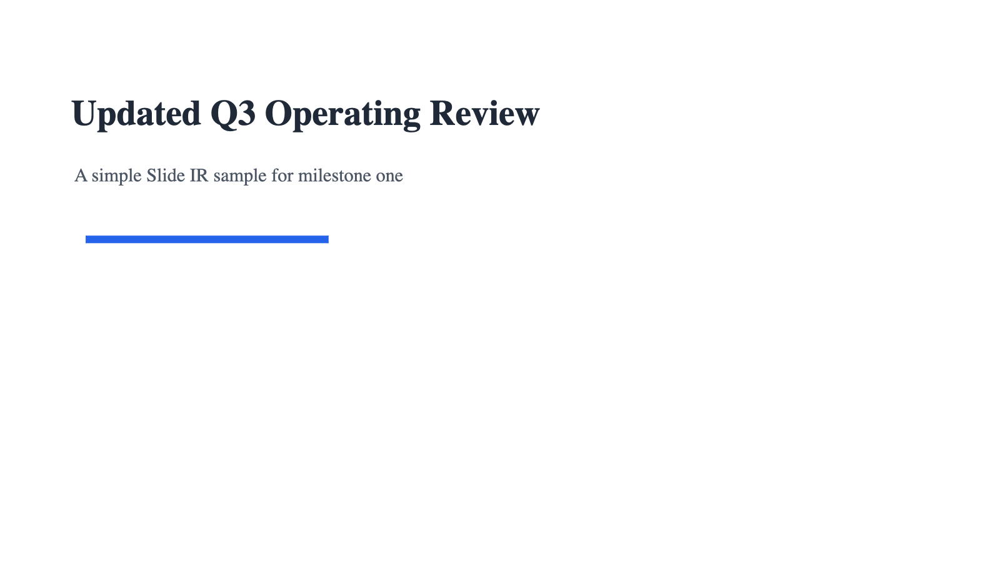

# ppt-agent

AI Presentation Agent that generates validated Slide IR, runs QA, applies structured edits, and renders editable PPTX.

`ppt-agent` is a Python toolkit for building presentation-generation pipelines around a strict intermediate representation instead of letting an LLM write PowerPoint files directly. The LLM, when enabled, only produces structured `Deck` JSON. Validation, QA, patching, and `.pptx` rendering are deterministic Python steps.

## What It Does

- Optionally generates Deck IR with LangChain structured output
- Accepts detailed user requirements and defaults generation to Chinese unless English is requested
- Validates Slide IR with Pydantic models
- Runs deterministic rule-based QA before accepting generated decks
- Applies structured JSON Patch Edit operations
- Renders editable PowerPoint files with `python-pptx`
- Exposes the workflow through a product CLI: `ppt-agent`

## Workflow



## Current Scope

Included:

- Python 3.11+ project structure with `uv`
- Pydantic v2 models for `Deck`, `Slide`, `BBox`, `TextStyle`, shape styles, and element types
- Minimal `Theme` schema for consistent rendering
- LangChain structured-output generation into Slide IR
- Rule-based QA for overlap, density, and text-fit checks
- Structured JSON Patch Edit
- Editable `.pptx` rendering with `python-pptx`
- Template-guided rendering for common slide layouts while preserving editable PowerPoint shapes
- Product CLI for `generate`, `qa`, `render`, `patch`, and `build`
- Private beta FastAPI backend for local job creation, status checks, artifact listing, and downloads

Not included yet:

- LangGraph workflow orchestration
- Frontend code
- External databases, RAG, or document grounding
- Natural-language editing
- image-to-PPT or image-to-editable-PPT
- HTML/SVG preview, Playwright, or LibreOffice

## Quick Start

```bash
uv sync
uv run pytest
```

Recommended one-step AI deck build:

```bash
uv run ppt-agent build \
  --topic "AI 教育应用" \
  --audience "大学生" \
  --slides 8 \
  --theme examples/theme.json \
  --output-dir examples/output \
  --requirements "做一份中文课堂展示，风格简洁现代，重点讲 AI 如何帮助学习，但要提醒学术诚信风险。" \
  --patch examples/sample_patch.json
```

The build command runs structured-output Deck IR generation, deterministic QA, optional structured patching, and deterministic PPTX rendering. The LLM only generates Slide IR; PowerPoint files are produced by the `python-pptx` renderer. Generation is Chinese-first by default; pass `--language en` or state English in the detailed requirements when an English deck is desired.

## Demo Artifacts

| Artifact | Purpose |
| --- | --- |
| `generated_deck_ir.json` | Validated Deck IR produced by structured generation |
| `generated_qa_report.json` | Final deterministic QA report for the generated deck |
| `generated_attempts.json` | QA-gated generation attempt history |
| `generated_deck.pptx` | Editable PowerPoint rendered from generated Deck IR |
| `patched_deck_ir.json` | Deck IR after applying structured patch operations |
| `patch_result.json` | Patch application result, including issues if any |
| `patched_deck.pptx` | Editable PowerPoint rendered from patched Deck IR |

## Demo Output

The demo output shows the same deck before and after applying `examples/sample_patch.json`.

- The sample deck is rendered from the original validated Slide IR.
- The patched deck applies structured edits to the same IR: the first-slide title changes to `Updated Q3 Operating Review`, and the accent bar is moved.
- Both `.pptx` files remain editable PowerPoint documents rendered by `python-pptx`.

## Screenshots

These screenshots are real previews of the existing PPTX artifacts under `examples/output/`. They are not AI-generated images, design mockups, or placeholders.

### Sample Deck: Slide 1


### Patched Deck: Slide 1



## CLI Usage

Generate Deck IR with QA-gated retry:

```bash
uv run ppt-agent generate \
  --topic "AI 教育应用" \
  --audience "大学生" \
  --slides 8 \
  --theme examples/theme.json \
  --output examples/output/generated_deck_ir.json \
  --requirements "做一份给大学课堂展示的中文 PPT，风格简洁现代，重点讲 AI 如何帮助学习，但要提醒学术诚信风险。" \
  --min-qa-score 80 \
  --max-attempts 2 \
  --qa-output examples/output/generated_qa_report.json \
  --attempts-output examples/output/generated_attempts.json
```

This command requires `OPENAI_API_KEY`. It writes Slide IR JSON and optional QA metadata; it does not generate PPTX directly. `--requirements` and its alias `--prompt` accept detailed natural-language generation requirements; they do not apply natural-language edits to an existing deck.

Render Deck IR to editable PowerPoint:

```bash
uv run ppt-agent render examples/output/generated_deck_ir.json \
  --theme examples/theme.json \
  --output examples/output/generated_deck.pptx
```

Run deterministic QA:

```bash
uv run ppt-agent qa examples/output/generated_deck_ir.json \
  --theme examples/theme.json \
  --output examples/output/generated_qa_report.json
```

Apply structured JSON Patch Edit:

```bash
uv run ppt-agent patch examples/sample_slide_ir.json \
  --patch examples/sample_patch.json \
  --output examples/output/patched_deck_ir.json \
  --result-output examples/output/patch_result.json
```

Patch Edit accepts structured JSON operations such as `update_text`, `move_element`, `resize_element`, and `update_shape_style`. It does not parse natural language and does not call an LLM.

## API Usage

The API is a private beta local backend for creating build jobs, checking status, listing artifacts, and downloading generated files. It reads `OPENAI_API_KEY` and optional `OPENAI_MODEL` from the server environment.

Start the local API:

```bash
uv run uvicorn ppt_agent.api:app --reload
```

Open the simple HTML private beta:

```text
http://127.0.0.1:8000
```

The page submits build jobs, polls status, and shows artifact download links. It currently uses a Chinese UI for private beta users. It is a small local browser entry point, not a complete product UI.

Create a job:

```bash
curl -X POST http://127.0.0.1:8000/api/jobs \
  -H "Content-Type: application/json" \
  -d '{
    "topic": "AI 教育应用",
    "audience": "大学生",
    "slides": 8,
    "theme_path": "examples/theme.json",
    "user_requirements": "做一份中文课堂展示，风格简洁现代，提醒学术诚信风险。",
    "min_qa_score": 80,
    "max_attempts": 2
  }'
```

Check status and artifacts:

```bash
curl http://127.0.0.1:8000/api/jobs/<job_id>
curl http://127.0.0.1:8000/api/jobs/<job_id>/artifacts
curl -L http://127.0.0.1:8000/api/artifacts/<artifact_id> --output artifact.bin
```

Job data and files are stored locally under `data/jobs/`. This API is intended for local private beta use, not production hosting.

## End-to-End Demo Helper

The scripts in `scripts/` are demo/helper entry points. The CLI above is the main product interface.

```bash
uv run python scripts/run_demo_pipeline.py
```

This helper writes example QA, patch, and PPTX artifacts under `examples/output/`.

## Design Principles

- Use structured data as the contract between AI generation and rendering
- Validate before rendering
- Run deterministic QA before accepting generated IR
- Keep `.pptx` rendering outside the LLM
- Use template-guided rendering to improve layout consistency without sacrificing editable PPTX output
- Prefer structured Patch Edit over natural-language mutation
- Keep generation, QA, patching, and rendering separable

The current renderer supports controlled layouts such as `title_slide`, `section_divider`, `two_column`, `three_column`, `four_cards`, `metric_cards`, and `closing_slide`. Card layouts render newline-separated content as editable heading/body text shapes. This is inspired by template-guided presentation generation, but `ppt-agent` does not integrate or depend on ppt-master at runtime.

## Architecture Note

The product build flow lives in `ppt_agent.pipeline.run_build_pipeline`. The CLI parses arguments, checks credentials, creates the model, calls the pipeline service, and prints artifact paths. The local job backend reuses the same service so CLI and API builds share one core path.

## Roadmap

- M1.4 GitHub demo showcase
- M2 LangGraph workflow orchestration
- M3 document/RAG grounding
- M4 image-to-editable-PPT research prototype

Roadmap items are planned future work unless they are listed in the current scope above.

## Examples

- `examples/sample_slide_ir.json` contains a three-slide sample deck.
- `examples/theme.json` contains the `clean_business` theme.
- `examples/sample_patch.json` contains a small structured patch.

All bounding boxes use PowerPoint-style inches:

```json
{
  "x": 0.7,
  "y": 0.6,
  "width": 6.2,
  "height": 1.0
}
```
