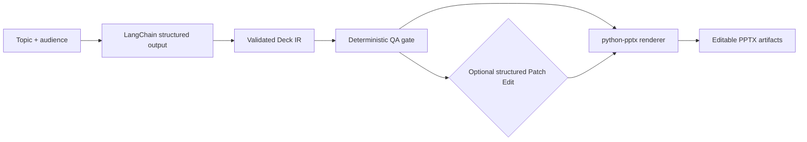

# ppt-agent

AI Presentation Agent that generates validated Slide IR, runs QA, applies structured edits, and renders editable PPTX.

`ppt-agent` is a Python toolkit for building presentation-generation pipelines around a strict intermediate representation instead of letting an LLM write PowerPoint files directly. The LLM, when enabled, only produces structured `Deck` JSON. Validation, QA, patching, and `.pptx` rendering are deterministic Python steps.

## What It Does

- Optionally generates Deck IR with LangChain structured output
- Validates Slide IR with Pydantic models
- Runs deterministic rule-based QA before accepting generated decks
- Applies structured JSON Patch Edit operations
- Renders editable PowerPoint files with `python-pptx`
- Exposes the workflow through a product CLI: `ppt-agent`

## Workflow



## Current Scope

Included:

- Python 3.11+ project structure with `uv`
- Pydantic v2 models for `Deck`, `Slide`, `BBox`, `TextStyle`, shape styles, and element types
- Minimal `Theme` schema for consistent rendering
- LangChain structured-output generation into Slide IR
- Rule-based QA for overlap, density, and text-fit checks
- Structured JSON Patch Edit
- Editable `.pptx` rendering with `python-pptx`
- Product CLI for `generate`, `qa`, `render`, `patch`, and `build`

Not included yet:

- LangGraph workflow orchestration
- FastAPI or frontend code
- Databases, RAG, or document grounding
- Natural-language editing
- image-to-PPT or image-to-editable-PPT
- HTML/SVG preview, Playwright, or LibreOffice

## Quick Start

```bash
uv sync
uv run pytest
```

Recommended one-step AI deck build:

```bash
uv run ppt-agent build \
  --topic "AI in Education" \
  --audience "university students" \
  --slides 8 \
  --theme examples/theme.json \
  --output-dir examples/output \
  --patch examples/sample_patch.json
```

The build command runs structured-output Deck IR generation, deterministic QA, optional structured patching, and deterministic PPTX rendering. The LLM only generates Slide IR; PowerPoint files are produced by the `python-pptx` renderer.

## Demo Artifacts

| Artifact | Purpose |
| --- | --- |
| `generated_deck_ir.json` | Validated Deck IR produced by structured generation |
| `generated_qa_report.json` | Final deterministic QA report for the generated deck |
| `generated_attempts.json` | QA-gated generation attempt history |
| `generated_deck.pptx` | Editable PowerPoint rendered from generated Deck IR |
| `patched_deck_ir.json` | Deck IR after applying structured patch operations |
| `patch_result.json` | Patch application result, including issues if any |
| `patched_deck.pptx` | Editable PowerPoint rendered from patched Deck IR |

## Screenshots

Screenshot slots are reserved for the GitHub demo showcase. They are not generated by this repository yet.

| Screenshot slot | Future path |
| --- | --- |
| Sample generated deck slide 1 | `docs/assets/sample_deck_slide_1.png` |
| Patched deck slide 1 | `docs/assets/patched_deck_slide_1.png` |

## CLI Usage

Generate Deck IR with QA-gated retry:

```bash
uv run ppt-agent generate \
  --topic "AI in Education" \
  --audience "university students" \
  --slides 8 \
  --theme examples/theme.json \
  --output examples/output/generated_deck_ir.json \
  --min-qa-score 80 \
  --max-attempts 2 \
  --qa-output examples/output/generated_qa_report.json \
  --attempts-output examples/output/generated_attempts.json
```

This command requires `OPENAI_API_KEY`. It writes Slide IR JSON and optional QA metadata; it does not generate PPTX directly.

Render Deck IR to editable PowerPoint:

```bash
uv run ppt-agent render examples/output/generated_deck_ir.json \
  --theme examples/theme.json \
  --output examples/output/generated_deck.pptx
```

Run deterministic QA:

```bash
uv run ppt-agent qa examples/output/generated_deck_ir.json \
  --theme examples/theme.json \
  --output examples/output/generated_qa_report.json
```

Apply structured JSON Patch Edit:

```bash
uv run ppt-agent patch examples/sample_slide_ir.json \
  --patch examples/sample_patch.json \
  --output examples/output/patched_deck_ir.json \
  --result-output examples/output/patch_result.json
```

Patch Edit accepts structured JSON operations such as `update_text`, `move_element`, `resize_element`, and `update_shape_style`. It does not parse natural language and does not call an LLM.

## End-to-End Demo Helper

The scripts in `scripts/` are demo/helper entry points. The CLI above is the main product interface.

```bash
uv run python scripts/run_demo_pipeline.py
```

This helper writes example QA, patch, and PPTX artifacts under `examples/output/`.

## Design Principles

- Use structured data as the contract between AI generation and rendering
- Validate before rendering
- Run deterministic QA before accepting generated IR
- Keep `.pptx` rendering outside the LLM
- Prefer structured Patch Edit over natural-language mutation
- Keep generation, QA, patching, and rendering separable

## Roadmap

- M1.4 GitHub demo showcase
- M2 LangGraph workflow orchestration
- M3 document/RAG grounding
- M4 image-to-editable-PPT research prototype

Roadmap items are planned future work unless they are listed in the current scope above.

## Examples

- `examples/sample_slide_ir.json` contains a three-slide sample deck.
- `examples/theme.json` contains the `clean_business` theme.
- `examples/sample_patch.json` contains a small structured patch.

All bounding boxes use PowerPoint-style inches:

```json
{
  "x": 0.7,
  "y": 0.6,
  "width": 6.2,
  "height": 1.0
}
```
