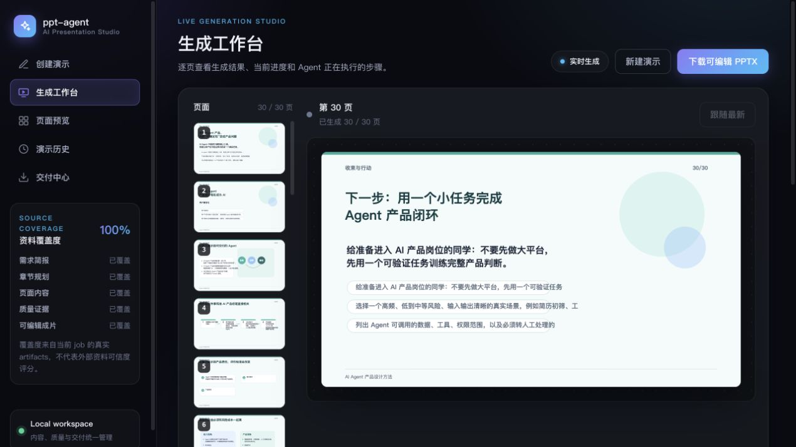
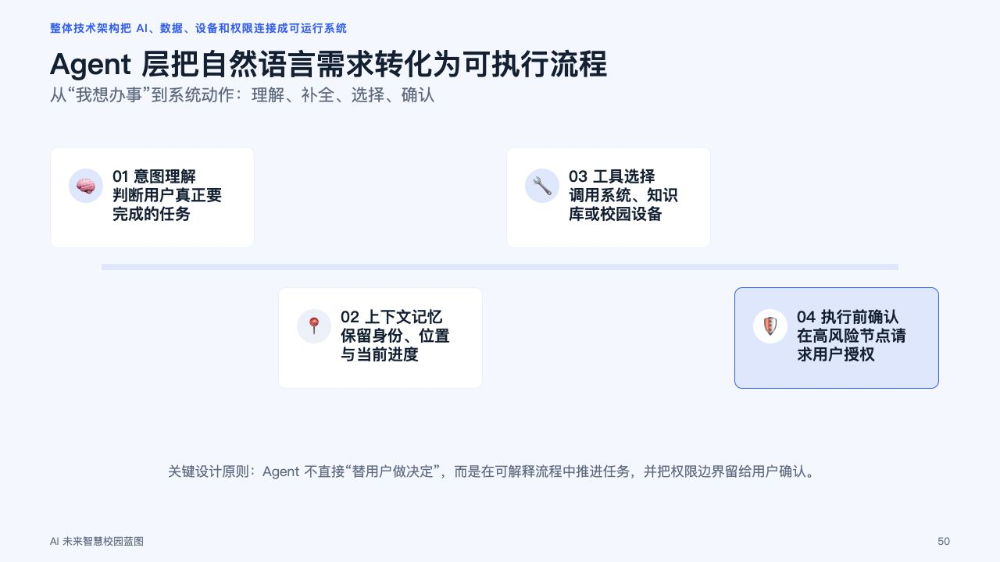
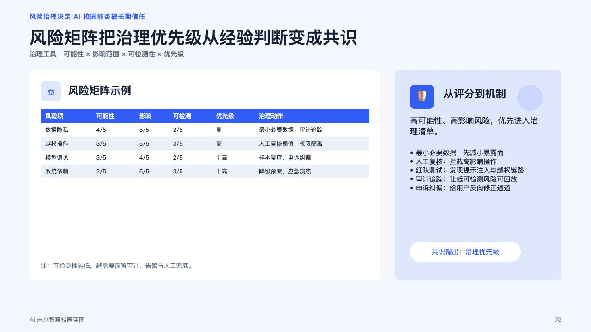
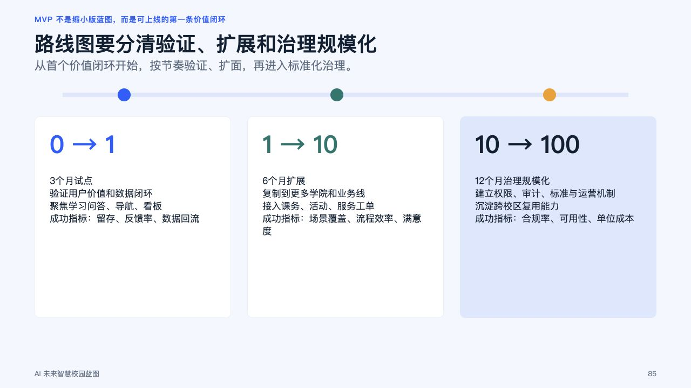
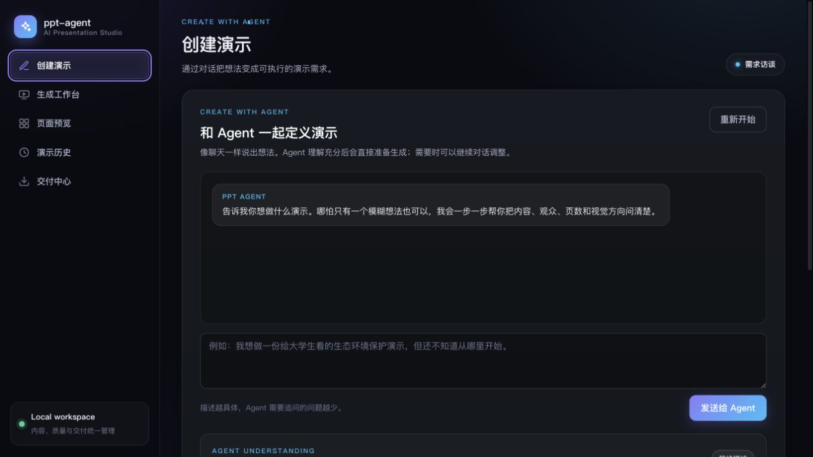
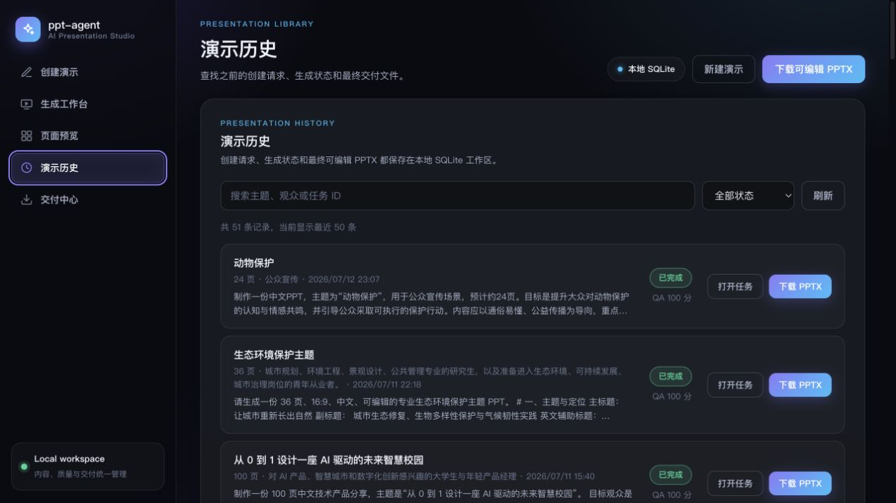
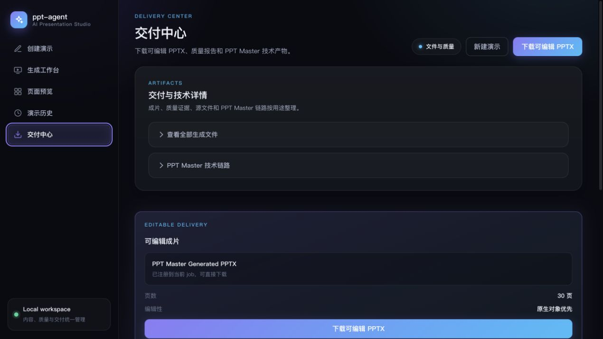

# ppt-agent

一个本地优先的 AI Presentation Agent：把一句话需求、详细 prompt 或文档资料，转化为经过结构化校验、全页质量检查并可继续编辑的 PowerPoint。

当前产品主线已经验证到 **100 页**。Web UI 提供统一的 1-100 页对话创建入口：1-3 页进入快速管线，4-100 页进入 v2 自由布局管线。legacy 30 页批次与 PPT Master recovery 作为兼容和恢复路径继续保留，但不再要求普通用户理解 batch、重试次数或 QA 阈值。

## 当前完成度

| 能力 | 当前状态 |
| --- | --- |
| 1-100 页统一 Web 创建入口 | 已完成 |
| 自适应需求访谈 Agent：单问题追问、快捷选项、自由回答、生成确认 | 已完成 |
| 创建、实时生成、页面预览、演示历史、交付中心分区工作台 | 已完成 |
| 独立 Web UI 静态资源与 Python package-data 打包 | 已完成 |
| 100 页真实 LLM 生成 | 已验证 |
| 原生可编辑 PPTX | 已完成 |
| v2 自由布局 PageDesign IR | 已完成 |
| 并发生成与 checkpoint resume | 已完成 |
| 全页 QA、自动修复、hard quality gate | 已完成 |
| 生成中逐页预览、可见区域缩略图加载、跟随最新页面 | 已完成 |
| SQLite 演示历史、job、进度、取消、恢复、artifact 下载 | 已完成 |
| OpenAI-compatible / Anthropic BYOK | CLI 与服务端环境变量可用 |
| PDF / DOCX / MD / TXT 提炼 | v2 CLI 可用，Web 尚未接上传 |
| Tavily 联网搜索 | v2 CLI 可用，Web 尚未接搜索开关 |
| PPT Master handoff / execution / local export / output registration | legacy long-deck 路线可用 |
| 通用 LLM tool calling；不支持 RAG；不支持多租户 | 尚未实现 |

## 真实 100 页成片

以下页面来自一次真实的 100 页 v2 job，不是旧模板截图，也不是整页图片塞入 PPTX。最终文件由 python-pptx 写入原生文本框、形状、图表和表格。

| 封面 | Agent 工作流 |
| --- | --- |
|  |  |

| 风险矩阵 | 产品路线图 |
| --- | --- |
|  |  |

这次已验证运行的真实数据：

- 100 页，16:9，中文，可编辑 PPTX。
- 99 次 LLM 调用，0 次调用失败。
- 84 个内容页由模型生成，16 个结构页由代码确定性生成。
- 250,912 input tokens，164,101 output tokens。
- 估算成本 $2.7219，预算上限 $15。
- 全页 QA errors：0；warnings：2。
- 确定性自动修复：58 次。
- fallback pages：0；LLM repair pages：0。
- strict quality gate：通过。

> 历史 job 记录了调用次数、token 和估算成本，但当时没有持久化 provider/model 名称，因此 README 不声称该次运行使用了某个可验证的具体模型。

## 产品工作台

Web UI 使用对话式 Agent 作为唯一创建入口：用户可以只给一句模糊想法，也可以直接提交完整需求。Agent 每轮只追问一个会影响内容、结构或视觉结果的问题，提供快捷选项，同时保留自由输入；信息充分后进入生成确认，再开始 1-100 页任务。结构化 Brief 只作为内部生成契约和恢复依据，不再让普通用户填写右侧表单。

| 对话创建 | 实时生成工作台 |
| --- | --- |
|  |  |

清晰需求会直接进入生成确认；模糊需求会按实际缺口继续追问，不预设固定问题数量。用户可以继续用自然语言调整已经收敛的需求；短演示或用户明确要求“直接生成 / 不用再问”时可以自动开始，长演示默认保留一次确认。访谈状态和完整消息保存在 SQLite，并通过 `interview_id` 与最终 presentation job 关联。

生成开始后，页面会逐步出现在左侧缩略图和中央画布中。缩略图只加载当前滚动区域附近的页面，因此 100 页任务不会同时创建 100 个 iframe；用户可以手动查看任意已生成页面，也可以继续跟随最新页面。

| SQLite 演示历史 | 交付中心 |
| --- | --- |
|  |  |

Web 前端保持零额外框架依赖，但已经从 FastAPI 模块中拆出：`webui/index.html` 负责语义结构，`webui/styles.css` 负责深色产品视觉，`webui/app.js` 负责对话、轮询、实时预览、历史和交付交互。FastAPI 在 `/static` 提供这些资源，setuptools 通过 package data 将它们带入安装包。这样修改 UI 不再需要在 `api.py` 中维护数千行内嵌字符串。

当前 Web 路由：

| 页数 | 内部管线 | 适用场景 |
| --- | --- | --- |
| 1-3 | v1 快速管线 | 极短汇报、单页说明、快速提案 |
| 4-100 | v2 自由布局管线 | 课堂展示、产品方案、深度分享与长文档 |

`POST /api/long-deck-jobs` 仍兼容没有指定 `deck_type=visual_design_v2` 的 legacy 30 页任务，用于已有 batch resume、quality gate 和 PPT Master recovery 工作流。

Web 工作台还包括：

- 五阶段任务进度与前端平滑运行计时。
- 临时请求失败后自动继续轮询。
- 对话状态、内部 Brief 与 job 关联恢复。
- v2 checkpoint 页面生成后立即进入 storyboard。
- 真实 SVG / PageDesign HTML 单页预览与视觉高光页选择。
- QA、成本、章节分配与交付状态。
- PPTX、IR、QA、run report 与 PPT Master artifacts 下载。
- SQLite 演示历史：搜索主题/观众/任务 ID、按状态筛选、打开旧任务、直接下载最终 PPTX。

每次创建演示时，系统会把主题、目标观众、页数和详细要求写入 `data/jobs.sqlite3` 的请求快照表。历史页将请求快照与 job 状态、QA 分数和最终 PPTX artifact 联结展示；旧任务会从已有 `long_deck_request.json` 或 `generated_deck_brief.json` 自动回填，不修改原始 artifact。

## 从 Prompt 到 PPTX

~~~mermaid
flowchart TD
    A["自然语言需求 / 文档摘要"] --> B["对话式需求访谈"]
    B --> C["内部结构化 Brief"]
    C --> D{"Web 页数路由"}
    D -->|"1-3"| E["v1 DeckBrief + DeckPlan"]
    D -->|"4-100"| F["v2 ContentBrief + ThemeSpec"]
    C -.->|"兼容 API: 30 页"| G["legacy batch generation"]

    E --> H["Strict Deck IR"]
    F --> I["Outline + PageBrief + PageDesign"]
    G --> J["Batch Deck IR merge"]

    H --> K["Rule QA"]
    I --> L["Per-page QA + deterministic repair"]
    J --> M["Long-deck QA + hard gate"]
    M --> N["PPT Master normal / recovery package"]

    K --> O["Editable PPTX"]
    L --> P{"Strict gate passed?"}
    M --> Q{"Gate passed?"}

    P -->|"Yes"| R["v2 editable PPTX"]
    P -->|"No"| S["Keep design / QA / run report"]
    Q -->|"Yes"| T["legacy editable PPTX"]
    Q -->|"No"| U["PPT Master recovery package"]

    O --> V["SQLite job + artifacts"]
    R --> V
    S --> V
    T --> V
    U --> V
    N --> V
~~~

核心原则：

1. LLM 不直接写 PPTX。
2. LLM 生成严格 JSON IR；Pydantic 拒绝 schema 外字段。
3. long-deck QA 与 hard gate 决定坏内容能否进入最终成片。
4. PowerPoint 由确定性 renderer 导出，保留原生可编辑元素。
5. 每个阶段都产生可检查 artifact，失败 job 仍可诊断和恢复。

## v2 100 页管线

v2 是当前 100 页主线：

~~~text
Prompt / source digest / optional search
                ↓
ContentBrief → ThemeSpec → DeckOutline → DeckSkeleton
                ↓
Section PageBriefs（按章节并发）
                ↓
Anchor pages（封面/目录/章节页/结尾，代码生成）
                +
Content PageDesign（每页独立 LLM 请求，并发生成）
                ↓
Rule QA → deterministic repair → optional LLM repair
                ↓
Strict full-deck quality gate
                ↓
DeckDesign JSON → editable PPTX → artifacts
~~~

### 为什么能稳定处理 100 页

- **每页一个请求**：避免把 100 页塞进一次超长模型调用。
- **并发池**：默认 concurrency 为 8。
- **checkpoint**：brief、theme、skeleton、section briefs 和每个内容页都独立保存。
- **resume**：中断后跳过已经完成且有效的页面。
- **结构页确定性生成**：减少 token，并稳定整份演示的视觉锚点。
- **严格 QA**：文本容量、重叠、越界和页面结构都进入检查。
- **预算护栏**：记录 token 和估算成本；内容页失败时可以进入确定性 fallback。

### v2 产物

| 文件 | 用途 |
| --- | --- |
| &lt;name&gt;.pptx | hard gate 通过后生成的可编辑 PowerPoint |
| &lt;name&gt;_design.json | ThemeSpec + 全部 PageDesign |
| &lt;name&gt;_qa_report.json | 全页 QA、自动修复与 fallback 记录 |
| &lt;name&gt;_run_report.json | 调用次数、token、成本估算、阶段耗时和逐页状态 |
| checkpoints/ | 断点续跑所需的阶段与逐页数据 |

## PPT Master 集成边界

项目没有复制或内置 [hugohe3/ppt-master](https://github.com/hugohe3/ppt-master) 源码。当前实现的是本地 workflow bridge：

~~~text
merged Deck IR
    ↓
sanitized source.md + run_prompt.md + manifest.json
    ↓
execution plan / visual project scaffold
    ↓
外部 AI IDE / Codex / Claude Code 生成 SVG visual project
    ↓
local runner:
  svg_quality_checker.py
  finalize_svg.py
  svg_to_pptx.py --only native
    ↓
generated_by_ppt_master.pptx
    ↓
注册到 ppt-agent job/artifact/Web UI
~~~

必须明确：

- PPT Master 的 AI 视觉项目生成阶段仍需要外部 AI IDE / skill workflow。
- ppt-agent 不会假装仅靠确定性脚本就能从 source.md 生成完整 SVG。
- Local Runner 只处理已经存在的 SVG project 或已有 PPTX。
- 当前 Web PPT Master endpoints 面向 legacy long_deck job；100 页 long_deck_v2 不会自动调用 PPT Master。
- v2 100 页成片使用自身 PageDesign renderer，不经过 PPT Master。

本地检测：

~~~bash
export PPT_MASTER_DIR="/Users/you/Documents/ppt-master"

uv run python scripts/check_ppt_master_setup.py \
  --ppt-master-dir "$PPT_MASTER_DIR"
~~~

主要辅助命令：

~~~bash
uv run python scripts/prepare_ppt_master_package.py --input ... --output-dir ...
uv run python scripts/prepare_ppt_master_execution.py --job-id ... --job-dir ...
uv run python scripts/bootstrap_ppt_master_project.py --job-id ... --job-dir ...
uv run python scripts/run_ppt_master_local_export.py --job-id ... --job-dir ...
uv run python scripts/register_ppt_master_output.py --job-id ... --output-dir ...
~~~

## 搜索、文档与工具能力

| 能力 | 实现方式 | Web | CLI |
| --- | --- | ---: | ---: |
| PDF / DOCX / MD / TXT | 本地解析后生成最多 24k 字符 digest | 尚未接入 | 已支持 |
| Tavily 搜索 | Python 直接调用 Tavily API，结果注入 brief | 尚未接入 | 已支持 |
| LLM provider | OpenAI-compatible / Anthropic JSON generation | 服务端环境变量 | BYOK 参数 |
| 通用 function calling | 未实现 | 否 | 否 |
| 不支持 RAG / vector database | 未实现 | 否 | 否 |

Tavily 是编排器明确调用的搜索适配器，不是模型自主选择工具。目前项目属于结构化 workflow agent，不是通用 ReAct/tool-calling agent。

## 快速开始

要求：

- Python 3.11+
- [uv](https://docs.astral.sh/uv/)
- 一个 OpenAI-compatible 或 Anthropic API endpoint

安装并验证：

~~~bash
git clone https://github.com/Liyilin66/ppt-agent.git
cd ppt-agent

uv sync
uv lock --check
uv run pytest
~~~

### 启动 Web UI

Web UI 不接收用户输入 API key，key 只从服务端环境变量读取：

~~~bash
export OPENAI_API_KEY="..."
export OPENAI_BASE_URL="https://your-openai-compatible-endpoint/v1"
export OPENAI_MODEL="gpt-5.5"

export PPT_MASTER_DIR="/Users/you/Documents/ppt-master"  # optional
export LONG_DECK_JOB_TIMEOUT_SECONDS=7200

uv run uvicorn ppt_agent.api:app --reload
~~~

打开 [http://127.0.0.1:8000](http://127.0.0.1:8000/)。

### v2 离线 demo

不调用真实模型：

~~~bash
uv run ppt-agent v2 demo \
  --prompt "AI Agent 产品经理成长路线" \
  --pages 100 \
  --output-dir examples/output/v2_demo
~~~

### v2 真实生成

~~~bash
export OPENAI_API_KEY="..."

uv run ppt-agent v2 build \
  --prompt "从 0 到 1 设计一座 AI 驱动的未来智慧校园" \
  --pages 100 \
  --provider openai \
  --model gpt-5.5 \
  --base-url https://your-openai-compatible-endpoint/v1 \
  --concurrency 8 \
  --budget-usd 15 \
  --input-cost 3 \
  --output-cost 12 \
  --output-dir out/smart-campus
~~~

断点续跑：

~~~bash
uv run ppt-agent v2 build \
  --prompt "从 0 到 1 设计一座 AI 驱动的未来智慧校园" \
  --pages 100 \
  --provider openai \
  --model gpt-5.5 \
  --base-url https://your-openai-compatible-endpoint/v1 \
  --output-dir out/smart-campus \
  --resume
~~~

文档提炼与联网搜索：

~~~bash
export TAVILY_API_KEY="..."

uv run ppt-agent v2 build \
  --prompt "把白皮书整理成一份技术产品分享" \
  --source docs/whitepaper.pdf \
  --search \
  --pages 80 \
  --output-dir out/whitepaper-deck
~~~

浏览器预览设计稿：

~~~bash
uv run ppt-agent v2 preview \
  --design out/smart-campus/deck_design.json \
  --output out/smart-campus/preview.html
~~~

## CLI

~~~text
ppt-agent generate     Generate strict Deck IR
ppt-agent build        Generate + QA + editable PPTX (v1)
ppt-agent render       Render existing Deck IR
ppt-agent qa           Analyze existing Deck IR
ppt-agent patch        Apply structured JSON patch

ppt-agent v2 demo      Offline deterministic 4-100 page demo
ppt-agent v2 build     Real-model 4-100 page generation
ppt-agent v2 preview   Render DeckDesign as browser HTML
~~~

## Web API

| Endpoint | 作用 |
| --- | --- |
| GET /health | 健康检查 |
| POST /api/jobs | 1-3 页 Web 快速任务；API 仍支持 1-10 页 |
| POST /api/long-deck-jobs | 4-100 页任务；Web 默认传入 `visual_design_v2` |
| POST /api/long-deck-jobs/{job_id}/resume | 从 checkpoint 恢复 |
| POST /api/jobs/{job_id}/cancel | 请求取消 long-deck job |
| GET /api/jobs/{job_id} | 状态、QA、PPT Master 状态 |
| POST /api/presentation-interviews | 开始自适应需求访谈 |
| POST /api/presentation-interviews/{id}/messages | 回答当前问题并继续收敛 Brief |
| GET /api/presentation-interviews/{id} | 恢复 SQLite 中的访谈状态 |
| GET /api/presentations | SQLite 演示历史、筛选和最终 PPTX 下载入口 |
| GET /api/jobs/{job_id}/preview-slides | 可用预览页清单 |
| GET /api/jobs/{job_id}/preview-slides/{n} | SVG 或 v2 HTML 单页预览 |
| GET /api/jobs/{job_id}/artifacts | 任务 artifacts |
| GET /api/artifacts/{artifact_id} | 下载 artifact |

PPT Master endpoints：

~~~text
POST /api/long-deck-jobs/{job_id}/prepare-ppt-master-execution
POST /api/long-deck-jobs/{job_id}/bootstrap-ppt-master-project
POST /api/long-deck-jobs/{job_id}/run-ppt-master-local-export
~~~

## 质量与安全边界

- Pydantic models 使用 strict schema，未知字段不会静默进入 IR。
- v2 默认 strict quality gate；全页仍有硬错误时不发布 PPTX。
- legacy 30 页 hard gate 失败时不生成旧 renderer PPTX，但可生成 sanitized PPT Master recovery package。
- PPT Master adapter 会清理 instruction leakage、matrix placeholders 与内部 schema 字段。
- job 超时、取消和失败均保留可检查 artifacts。
- 本地 runner 使用 subprocess timeout，不自动安装依赖，不自动更新 PPT Master。

## 当前限制

- 最高页数承诺为 100；200 页没有真实验证，因此已从产品和 CLI 上限移除。
- Web UI 尚未接入文件上传和联网搜索开关。
- Web UI 不允许用户直接填写 API key。
- 不支持 image-to-PPT 或 image-to-editable-PPT。
- 没有通用 LLM tool calling；不支持 RAG、向量数据库或多 Agent runtime。
- 没有登录、多租户、云端队列或生产级权限系统。
- v2 100 页与 PPT Master 当前是两条独立视觉生成路线。
- PPT Master 的 SVG 创作阶段仍依赖外部 AI IDE / skill workflow。
- 项目优先保证可编辑性、可检查性和失败可恢复，不保证所有模型都能产生同等视觉质量。

## 项目结构

~~~text
src/ppt_agent/
├── api.py                     # FastAPI + Web workspace + job endpoints
├── webui/                     # 独立、无框架依赖的 Web 产品界面
│   ├── index.html             # 五个产品视图和语义结构
│   ├── styles.css             # 深色设计系统与响应式布局
│   └── app.js                 # 对话、任务轮询、实时预览和历史交互
├── requirements_interview.py  # 自适应对话访谈与内部 Brief
├── job_store.py               # SQLite jobs、访谈、请求快照与 artifacts
├── generation.py              # v1 structured generation
├── pipeline.py                # v1 build/QA/render pipeline
├── long_deck_orchestrator.py  # legacy 30-page batching/resume
├── long_deck_quality.py       # legacy hard quality gate
├── ppt_master_*.py            # handoff, execution, project, runner, output
└── v2/
    ├── orchestrator.py        # 100-page pipeline
    ├── providers.py           # OpenAI-compatible / Anthropic BYOK
    ├── planning.py            # brief, outline, skeleton, page briefs
    ├── ir.py                  # PageDesign / DeckDesign
    ├── qa.py                  # page QA and deterministic repair
    ├── render.py              # editable PPTX renderer
    ├── preview.py             # browser preview
    ├── intake.py              # PDF/DOCX/MD/TXT
    └── search.py              # Tavily adapter

scripts/                       # PPT Master bridge and registration CLIs
tests/                         # v1, v2, Web API and PPT Master tests
docs/readme/                   # current README screenshots
docs/design/                   # UI visual QA evidence
~~~

## 测试

当前验证基线：

~~~text
460 passed
uv sync
uv lock --check
uv run pytest
git diff --check
~~~

测试不会调用真实模型，不会打开 PowerPoint，也不会执行完整 PPT Master AI workflow。

## License

当前仓库未声明开源许可证。使用或分发前请先补充明确的 license。
