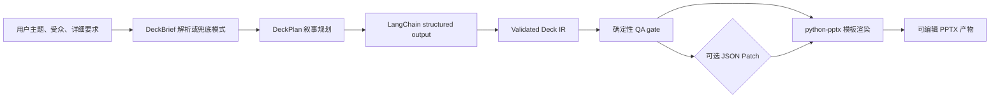

# ppt-agent

`ppt-agent` 是一个用于生成、校验、修改并渲染可编辑 PowerPoint 的 Python 工具链。它的核心思路不是让大模型直接写 `.pptx`，而是让大模型只生成严格的 `Deck` 结构化 JSON；后续的校验、质量检查、补丁修改和 PowerPoint 渲染都由确定性的 Python 代码完成。

当前项目更关注“可控生成”和“可编辑 PPTX”，而不是把页面截图塞进幻灯片。所有内置模板都会输出 PowerPoint 原生文本框、形状和线条。

## 当前能力

已包含：

- 基于 Pydantic v2 的严格 Slide IR：`Deck`、`Slide`、`BBox`、`TextStyle`、形状样式和元素类型。
- 中文优先的生成流程：默认 `zh-CN`，只有用户明确要求英文时才生成英文内容。
- `DeckBrief` 快速路径和兜底模式：需求解析 LLM 超时或失败时，可用确定性 brief 继续生成。
- `DeckPlan` 规划层：包含 `slide_role`、`recommended_layout`、`content_items` 和叙事顺序约束。
- 代码内置设计约束：`DesignSpec`、`SlideRole`、`LayoutContract` 注册表。
- 受控布局模板：`title_slide`、`section_divider`、`two_column`、`three_column`、`four_cards`、`metric_cards`、`closing_slide`、`comparison_matrix`、`process_flow`、`risk_matrix`、`key_takeaway`。
- 仅渲染层的确定性视觉变体：同一输入稳定复现，同时降低同一 deck 内的模板重复感。
- 专业布局渲染：对比矩阵、流程图、风险矩阵、KPI 指标、关键结论页和行动清单页。
- 轻量视觉预检 QA：检查过空、过密、文本溢出风险、标题换行风险和视觉模式重复。
- QA 门槛语义区分：PPTX 已生成但 QA 未过时，不等同于运行时失败。
- 结构化 JSON Patch Edit：支持更新文本、移动元素、缩放元素和更新形状样式。
- `python-pptx` 可编辑 `.pptx` 渲染。
- 产品 CLI：`generate`、`qa`、`render`、`patch`、`build`。
- 本地私有 beta FastAPI：创建任务、查询状态、查看当前阶段、列出和下载产物。

当前不包含：

- LangGraph 工作流编排。
- RAG 或外部文档 grounding。
- image-to-PPT / image-to-editable-PPT。
- 多模型选择 UI。
- 用户在 Web UI 输入 API key。
- React、Next.js、Streamlit 或完整前端框架。
- 外部数据库或生产级托管。
- ppt-master runtime 集成。

## 工作流



## 快速开始

安装依赖并运行测试：

```bash
uv sync
uv run pytest
```

推荐的一步生成命令：

```bash
uv run ppt-agent build \
  --topic "AI Agent 产品经理" \
  --audience "IT 硕士学生" \
  --slides 8 \
  --theme examples/theme.json \
  --output-dir examples/output \
  --requirements "做一份中文技术产品分享 PPT，重点讲技术边界、用户需求分析、工作流设计、评估指标和落地风险。风格不要像营销材料，背景色要极淡蓝绿色。" \
  --min-qa-score 80 \
  --max-attempts 1
```

`build` 会完成需求解析、DeckPlan、结构化 Deck IR 生成、QA、PPTX 渲染和可选 patch。大模型只生成结构化 IR；PowerPoint 文件由本地 renderer 生成。

## 生成产物

`build` 常见输出：

| 文件 | 用途 |
| --- | --- |
| `generated_deck_brief.json` | 需求解析结果，记录 brief 来源和兜底信息。 |
| `generated_deck_plan.json` | DeckPlan，包括 slide role、layout 建议和叙事顺序。 |
| `generated_deck_ir.json` | 通过 Pydantic 校验的 Deck IR。 |
| `generated_qa_report.json` | 最终 QA 报告。 |
| `generated_attempts.json` | 带 QA 门槛的生成尝试历史。 |
| `generated_deck.pptx` | 从 Deck IR 渲染出的可编辑 PowerPoint。 |
| `patched_deck_ir.json` | 应用结构化 patch 后的 Deck IR。 |
| `patch_result.json` | patch 执行结果和问题列表。 |
| `patched_deck.pptx` | patch 后重新渲染的可编辑 PowerPoint。 |

## CLI 用法

生成 Deck IR 并运行 QA gate：

```bash
uv run ppt-agent generate \
  --topic "AI 教育应用" \
  --audience "大学生" \
  --slides 8 \
  --theme examples/theme.json \
  --output examples/output/generated_deck_ir.json \
  --requirements "做一份给大学课堂展示的中文 PPT，风格简洁现代，重点讲 AI 如何帮助学习，但要提醒学术诚信风险。" \
  --min-qa-score 80 \
  --max-attempts 2 \
  --qa-output examples/output/generated_qa_report.json \
  --attempts-output examples/output/generated_attempts.json
```

这个命令需要服务端环境里有 `OPENAI_API_KEY`。它只写出 Deck IR JSON 和 QA 元数据，不直接生成 PPTX。

将 Deck IR 渲染成可编辑 PowerPoint：

```bash
uv run ppt-agent render examples/output/generated_deck_ir.json \
  --theme examples/theme.json \
  --output examples/output/generated_deck.pptx
```

运行确定性 QA：

```bash
uv run ppt-agent qa examples/output/generated_deck_ir.json \
  --theme examples/theme.json \
  --output examples/output/generated_qa_report.json
```

应用结构化 JSON Patch：

```bash
uv run ppt-agent patch examples/sample_slide_ir.json \
  --patch examples/sample_patch.json \
  --output examples/output/patched_deck_ir.json \
  --result-output examples/output/patch_result.json
```

Patch Edit 接受结构化操作，例如 `update_text`、`move_element`、`resize_element` 和 `update_shape_style`。它不解析自然语言，也不调用 LLM。

## 本地 API / 私有 beta 页面

启动本地 API：

```bash
uv run uvicorn ppt_agent.api:app --reload
```

打开浏览器：

```text
http://127.0.0.1:8000
```

这个页面用于本地私有 beta：提交 build job、轮询状态、显示当前阶段、展示错误信息和下载产物。它不是完整产品前端。

创建任务：

```bash
curl -X POST http://127.0.0.1:8000/api/jobs \
  -H "Content-Type: application/json" \
  -d '{
    "topic": "AI Agent 产品经理",
    "audience": "IT 硕士学生",
    "slides": 8,
    "theme_path": "examples/theme.json",
    "user_requirements": "做一份中文技术产品分享 PPT，重点讲技术边界、用户需求分析、工作流设计、评估指标和落地风险。",
    "min_qa_score": 80,
    "max_attempts": 1
  }'
```

查询任务和下载产物：

```bash
curl http://127.0.0.1:8000/api/jobs/<job_id>
curl http://127.0.0.1:8000/api/jobs/<job_id>/artifacts
curl -L http://127.0.0.1:8000/api/artifacts/<artifact_id> --output artifact.bin
```

任务数据和文件默认存放在 `data/jobs/`。该目录用于本地运行，不应当作为生产存储。

## QA 与任务状态

QA 分数用于判断生成结果是否达到质量门槛，但 warning 不会直接把一个可用 PPTX 判成运行时失败。

状态语义：

- `succeeded` + `accepted=true`：PPTX 已生成，QA 分数达到门槛。
- `succeeded` + `accepted=false`：PPTX 和产物已生成，但 QA 未过；Web UI 会显示“已生成，但未通过 QA”。
- `failed`：LLM 超时、供应商错误、渲染错误、patch 路径错误或产物写入失败等运行时错误。

当前任务流水线会记录阶段级日志和可见进度，例如：

- `build_brief`
- `generate_deck_plan`
- `generate_deck`
- `render_pptx`
- `apply_patch`
- `save_artifacts`
- `complete_job`

LLM 调用有单次超时保护，整个 job 也有总超时保护，避免任务永远停在 running。

## 设计与布局约束

`ppt-agent` 把视觉约束放在代码里，而不是完全交给 prompt。

核心对象：

- `DesignSpec`：主题名、视觉语气、密度、字号比例、强调色和背景风格。
- `SlideRole`：受控角色，包括 `cover`、`context`、`comparison`、`framework`、`process`、`metrics`、`risk`、`summary`。
- `LayoutContract`：每种 layout 的适用场景、必需槽位、可选槽位、容量上下限和避免场景。

当前 LayoutContract 注册表覆盖：

- `title_slide`
- `section_divider`
- `two_column`
- `three_column`
- `four_cards`
- `metric_cards`
- `closing_slide`
- `comparison_matrix`
- `process_flow`
- `risk_matrix`
- `key_takeaway`

DeckPlan 会校验 `recommended_layout` 是否在注册表内，并检查 `content_items` 是否符合 layout 容量。

## 叙事顺序保护

DeckPlan 需要遵守基本叙事顺序：

1. 封面。
2. 背景、价值、为什么重要、问题铺垫。
3. 对比、责任边界、before/after。
4. 框架、技术边界、概念模型。
5. 用户需求、任务拆解。
6. 工作流、流程。
7. 指标、评估。
8. 风险、治理。
9. 核心结论、关键 takeaway。
10. closing、下一步行动、行动清单。

确定性 DeckPlan 构建器会在生成后进行叙事排序，避免 10 页或更长 deck 中出现“核心结论之后又回到背景页”的问题。`DeckPlan` 校验器也会拒绝明显乱序的计划，例如 conclusion 后才出现 context/background/value，或 closing_slide 不在最后。

## 渲染策略

renderer 使用模板和确定性视觉变体：

- 同一输入会稳定生成同样 variant。
- variant 只改变视觉排布，不改变内容语义。
- 不使用随机数。
- 不让 LLM 自由控制 bbox。
- 输出仍然是 PowerPoint 可编辑元素。

不同 layout 的信息架构会尽量拉开：

- `comparison_matrix`：对齐的对比行和决策规则。
- `process_flow`：横向流程或 3+2 两行流程，连接线不穿过文本。
- `risk_matrix`：风险、影响、缓解措施三列。
- `metric_cards`：支持 2-4 个 KPI，4 个指标使用 2x2 或 KPI board 风格。
- `key_takeaway`：强结论页，包含核心结论和下一步。
- `closing_slide`：行动清单结构，保持 heading + explanation 成对。

## 演示截图

这些截图来自 `examples/output/` 下已有 PPTX 产物，不是 AI 生成图片、设计稿或占位图。

### 示例 deck 第 1 页


### patch 后 deck 第 1 页


## 演示辅助脚本

`scripts/` 下的脚本是演示和辅助入口。主产品入口仍然是 CLI。

```bash
uv run python scripts/run_demo_pipeline.py
```

该脚本会在 `examples/output/` 下写入示例 QA、patch 和 PPTX 产物。

## 设计原则

- 用结构化数据作为 AI 生成和渲染之间的契约。
- 先校验，再渲染。
- 用确定性 QA 发现明显质量风险。
- 把 `.pptx` 渲染留在本地代码里，而不是交给 LLM。
- 用代码内置 LayoutContract 控制容量和布局选择。
- 用 renderer 模板和视觉变体提升专业感，同时保留可编辑 PPTX。
- 优先使用结构化 Patch Edit，而不是自然语言直接改 deck。
- 保持生成、QA、patch、渲染和任务运行时可拆分。

## 示例文件

- `examples/sample_slide_ir.json`：三页示例 Deck IR。
- `examples/theme.json`：`clean_business` 主题，默认使用极淡蓝绿色背景。
- `examples/sample_patch.json`：结构化 patch 示例。

所有 bbox 都使用 PowerPoint 风格的英寸单位：

```json
{
  "x": 0.7,
  "y": 0.6,
  "width": 6.2,
  "height": 1.0
}
```
