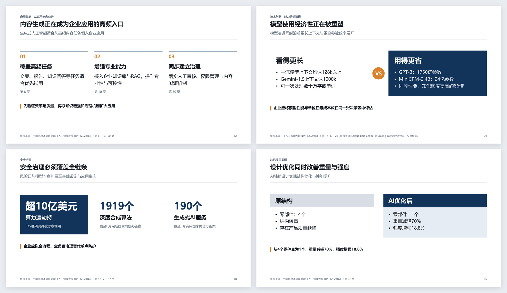

# ppt-agent

**把一份报告变成管理层能直接用的 PPT：每个数字都标着原文页码，配错的数字会被拦下，导出的是能直接改的 PowerPoint。**



<sub>上图四页来自 [样例 PPTX](examples/caict-2024-sample.pptx)：输入是一份项目此前没用过的 64 页行业报告，20 页成稿未经人工修改。页脚是引用的报告名与 PDF 页码（报告名从封面识别），卡片底部是该要点所在的页。</sub>

- **有出处**：资料按页码切分，每页只拿到与它相关的原文段落，页脚标注报告名和 PDF 页码，联网资料标注网站和标题；引用了没拿到的页会被剔除。
- **数字核对**：页面上的每个数字都要在引用页里找到，而且要和它说明的指标对得上，否则重试，仍不过就删除。
- **原生可编辑**：文字、形状、图表都是 PowerPoint 原生元素，不是截图；图表数据可以在 PowerPoint 里直接编辑。
- **能被 AI Agent 调用**：自带 MCP 服务，可接入 Claude Code、Codex、Cursor 等，用一句话生成、查进度、改页（[接入方法](#作为-mcp-工具接入-claude-codecodex-等-agent)）。

## 解决什么问题

用大模型直接做汇报 PPT，常见三个问题：

1. **数字看起来很真，但对不上原文。** 模型会把 A 指标的数字写到 B 指标上，或凭记忆补一个数字，读者无从核对。
2. **长资料只读了前半部分。** 把整份报告塞进上下文会被截断，或被模型「概括」掉后半部分的数据。
3. **导出的是图片，改不动。** 一页一张图，改个字都要重新生成。

## 怎么做到的


```mermaid
flowchart LR
    A["上传报告<br/>+ 可选联网搜索"] --> B["按页解析<br/>识别章节"]
    B --> C["按章节规划大纲<br/>预先分配版式"]
    C --> D["每页检索相关原文<br/>（带页码）"]
    D --> E["模型只写内容<br/>（并发）"]
    E --> F{"出处与<br/>数字核对"}
    F -->|"不通过"| E
    F -->|"通过"| G["代码排版"]
    G --> H["原生可编辑 PPTX"]
```

1. **按页解析，识别章节。** PDF 保留物理页码；章节标题支持「第X章」「一、」「1.」等常见格式。
2. **先规划，再并发。** 大纲按章节分配页数，全书的版式组合（要点、流程、图表、指标、对比、时间线等）在调用模型前一次定好：只有原文里有数据的页才会分到图表，相邻页不重复。
3. **每页只给相关原文。** 先定位章节，再用 BM25 检索 4 段左右原文，每段标注来源页码；联网结果标注网址。
4. **模型只写内容，不碰坐标。** 模型输出结构化 JSON（标题、要点、数字和出处），坐标、字号、换行全部由代码按实际文字量计算。
5. **核对后才上页。** 出处必须是这一页真正拿到的文件和页码；数字要在引用页中找到，并且和标签对得上。不通过时把原文那句话发回给模型重写，仍不通过就删掉那个数字，不会编一个补上。

### 一个真实例子

测试 CNNIC《生成式人工智能应用发展报告（2025）》时，报告图 4（PDF 第 17 页）显示用户使用目的中「作为生活助手」占 30.0%、「生成会议纪要、PPT」占 29.7%。

模型写成了「会议纪要/PPT：30.0%」。数字本身在原文里存在，所以只查「有没有这个数」是发现不了的；核对器按「这个数字属于哪个标签」检查，拦下了它。另一类问题正相反：核对器曾把「缺陷检\n测，准确率超 90%」这种被 PDF 换行拆开的正确数字也拦掉，这些都记录在 [失败记录](eval/failures.md) 和 [泛化检验报告](eval/results/generalization-2026-10-07.md) 里。

## 实测

| 场景 | 结果 | 记录 |
|---|---|---|
| 100 页真实生成（联网资料，87 个内容页） | 约 10.5 分钟；退化 1 页（1.1%）；出处不合格 0 页；PowerPoint 实际抽查 28 页无溢出 | [scale-up-100](eval/results/scale-up-100-2026-10-06.md) |
| 换一份没用过的 64 页报告（信通院） | 5 个一级章节全部识别；20 页导出后逐页检查无溢出；按章节分配资料 10/17 页 | [generalization](eval/results/generalization-2026-10-07.md) |
| Claude Code 通过 MCP 真实运行 | 20 页约 5 分钟；修订 1 页约 1 分钟 | [MCP Claude Code 运行记录](eval/results/mcp-claude-code-2026-10-07.md) |
| T3：63 页 CNNIC 报告，15 条标准事实 | 资料页送达 14/15（标准事实所在页是否进入了某一页的检索结果；不是语义召回率） | [T3 page recall](eval/results/T3-page-recall-2026-10-07.md) |

数字核对的修正也用历史数据验证过：所有历史运行中被判为「指标不匹配」的 59 个数值重新检查，25 个改为放行，逐条对照原文均正确，34 个仍拦下。

## 设计取舍

- **为什么不让模型直接写 PPTX 或算坐标。** 模型自由排版时，常出现装不下正文的文本框、贴着画布边缘的文字和视觉重量相同的卡片。现在模型只选版式原型、写内容，22 种构图由代码按文字量排版，每次改动都用 PowerPoint 实际导出检查。规则检查通过不等于 PowerPoint 里没问题，这一点项目里踩过坑（[E1](eval/failures.md)）。
- **为什么检索先用 BM25，不上向量库。** 行业报告里专有名词和数字多，按字面匹配往往更准；再加上先按章节缩小范围，T3 的资料页送达率是 14/15。没有数据证明向量检索更好之前，不增加这层复杂度。检索器是可替换的接口。
- **慢模型 + 网关超时怎么跑 100 页。** 测试用的代理模型每秒约输出 35 个 token，网关约 125 秒强制断开。所以每次调用都要足够小：大纲只要骨架，逐页脚本每批最多 6 页，内容页并发生成；某一批失败只退化那一批，不会拖垮整份 PPT。

## 快速开始

需要 Python 3.11+、[uv](https://docs.astral.sh/uv/)，以及一个 OpenAI-compatible 或 Anthropic 接口。

```bash
git clone https://github.com/Liyilin66/ppt-agent.git
cd ppt-agent
uv sync
```

在根目录 `.env` 中配置（已被 Git 忽略）：

```bash
PPT_AGENT_API_KEY=sk-...
# PPT_AGENT_BASE_URL=https://your-openai-compatible-endpoint/v1
# PPT_AGENT_MODEL=...
# TAVILY_API_KEY=...        # 可选：联网搜索
```

启动 Web 界面（[http://127.0.0.1:8000](http://127.0.0.1:8000/)）：

```bash
uv run uvicorn ppt_agent.api:app
```

或用命令行，根据一份报告生成 20 页：

```bash
uv run ppt-agent v2 build --prompt "基于附件为管理层做一份行业汇报" \
  --source report.pdf --search --pages 20 --output-dir out/report-deck
```

不调用模型的离线演示：`uv run ppt-agent v2 demo --prompt "AI Agent 入门" --pages 20 --output-dir out/demo`。

## 作为 MCP 工具接入 Claude Code、Codex 等 Agent

ppt-agent 自带一个本地 stdio MCP 服务，任何支持 MCP 的 Agent 都能直接调用它生成和修改 PPT。先按「快速开始」配置仓库根目录的 `.env`，所有客户端用的都是同一条启动命令：

```bash
uv --directory <仓库绝对路径> run ppt-agent mcp
```

| 客户端 | 配置方式 | 验证 |
|---|---|---|
| Claude Code | `claude mcp add ppt-agent -- uv --directory <仓库绝对路径> run ppt-agent mcp` | 已真实运行：生成 20 页并修订 1 页（[记录](eval/results/mcp-claude-code-2026-10-07.md)） |
| Codex | 在 `~/.codex/config.toml` 中加入下面的 `[mcp_servers.ppt-agent]` | 已实测连接与调用：查询上面那次任务的状态，返回与记录一致；未在 Codex 中跑完整生成 |
| Cursor、Claude Desktop 等 | 在各自的 MCP 配置文件中加入下面的 `mcpServers` JSON | 通用配置 |

Codex（`~/.codex/config.toml`）：

```toml
[mcp_servers.ppt-agent]
command = "uv"
args = ["--directory", "<仓库绝对路径>", "run", "ppt-agent", "mcp"]
startup_timeout_sec = 30  # 首次启动 uv 可能要先同步依赖
```

Cursor（`~/.cursor/mcp.json`）、Claude Desktop（`claude_desktop_config.json`）等使用 `mcpServers` 格式的客户端：

```json
{
  "mcpServers": {
    "ppt-agent": {
      "command": "uv",
      "args": ["--directory", "<仓库绝对路径>", "run", "ppt-agent", "mcp"]
    }
  }
}
```

配置要点：

- 必须保留 `--directory`：服务靠工作目录找到 `.env` 和默认的 `data/`，否则读不到模型配置，或另建一份任务数据库。网页与 MCP 使用同一个仓库目录，演示历史就是共享的；若设置了 `PPT_AGENT_DATA_DIR`，两边须指向同一个目录。
- 桌面应用（Codex、Claude Desktop、Cursor）可能找不到 `uv`：把 `command` 换成 `which uv` 输出的绝对路径。
- 注册或修改后，重开会话才会加载新工具。

三个工具：

- `create_deck`：提交需求、页数和本地附件的绝对路径，立即返回 `job_id`。
- `get_deck_status`：查询进度、已有质量统计（含退化页页码）、最近一次运行的估算费用（不累计）、完成后的 PPTX 绝对路径，以及最近一次修订结果。
- `revise_deck`：提交修改要求和可选页码，立即返回 `revision_id`，结果通过 `get_deck_status` 查看。

生成要几分钟，所以工具都立即返回编号，由 Agent 轮询进度。对 Agent 说的话可以很简单：

```text
你：用 /绝对路径/报告.pdf 给管理层做 20 页汇报，咨询风格，不联网。每分钟查一次进度，完成后告诉我 PPTX 路径和出处统计。
你：把第 5 页改成对比形式，然后查询修订结果。
```

**MCP 是对外入口，内部仍是固定的生成流程，不是让模型自己决定步骤。** Agent 负责提交需求和修改要求；生成、检索、核对和排版复用现有流程。

限制：任务跑在 MCP 进程里，会话关闭导致进程退出后，未完成的任务会中断，可以在网页的演示历史里续跑。同一个 MCP 进程同一时间只能有一个生成任务；同一份演示文稿同时只能有一个修订。工具返回本地绝对路径，不返回文件内容。

## 其他能力

- **对话式创建**：一句话需求也能开始，Agent 每轮只追问一个关键问题；4-100 页可先编辑大纲和逐页脚本再生成。
- **成片后用自然语言修改**：如「第 5 页改成对比」「全稿换成深蓝色」，只重做受影响的页面。
- **图片转可编辑页面**：把 PPT 截图或信息图重建为原生文本、形状和图表。
- **四种风格**：咨询、发布会、培训、企业汇报，按演示类型自动选择。
- **断点续跑、预算护栏、演示历史与交付中心。**

完整功能、Web 工作台截图、CLI 参数、Web API 和旧路线（v1 / legacy 30 页 / PPT Master）见 [参考文档](docs/reference.md)。

## 当前限制

- 只在中文报告上验证过；不支持扫描版 PDF（没有 OCR），PDF 里的表格会被抽成打乱的文字，图表中的数字读不到。
- 数字核对是规则匹配，不是语义判断：标签改写得太远的正确数字会被误删，引用页码只核对到「这一页拿到过这页资料」，不证明每一句话都出自该页。
- 还没有表格版式；图片转可编辑页面没有做最新一轮评测。

## 测试

```bash
uv run pytest
```

1699 个测试，不调用真实模型，也不打开 PowerPoint。PowerPoint 渲染检查用 `scripts/pptx_snapshot.sh` 单独运行。

## License

当前仓库未声明开源许可证。使用或分发前请先补充明确的 license。
